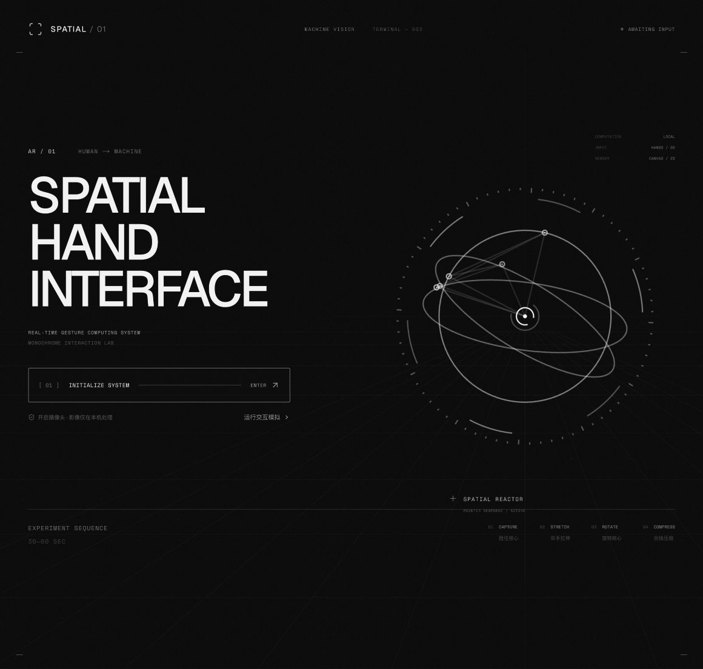
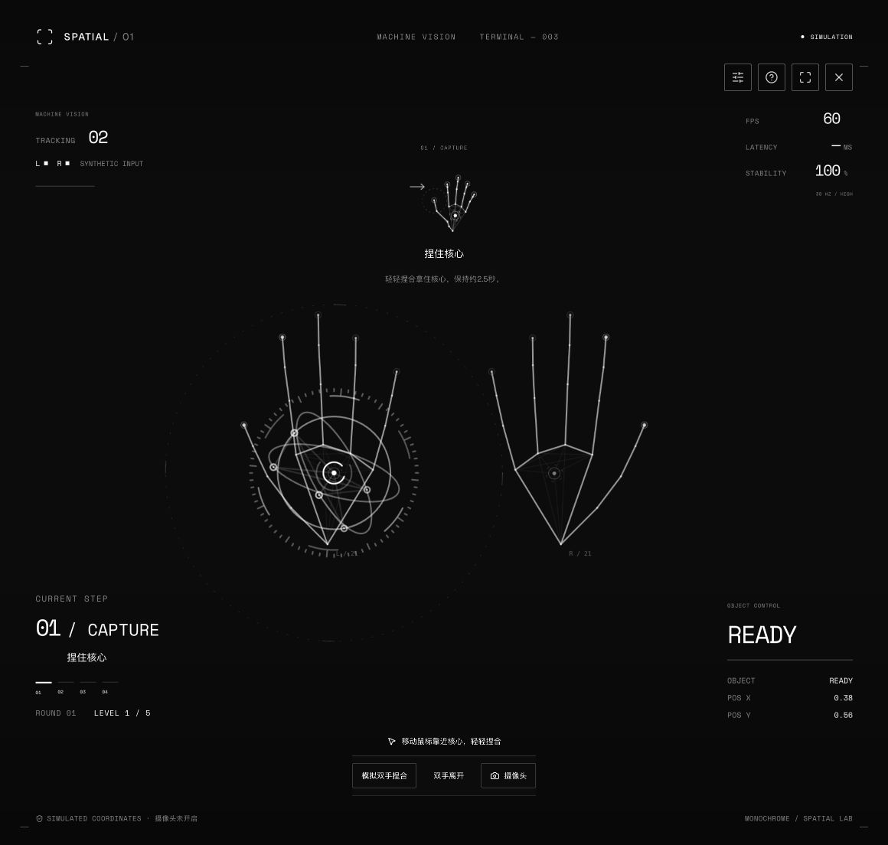
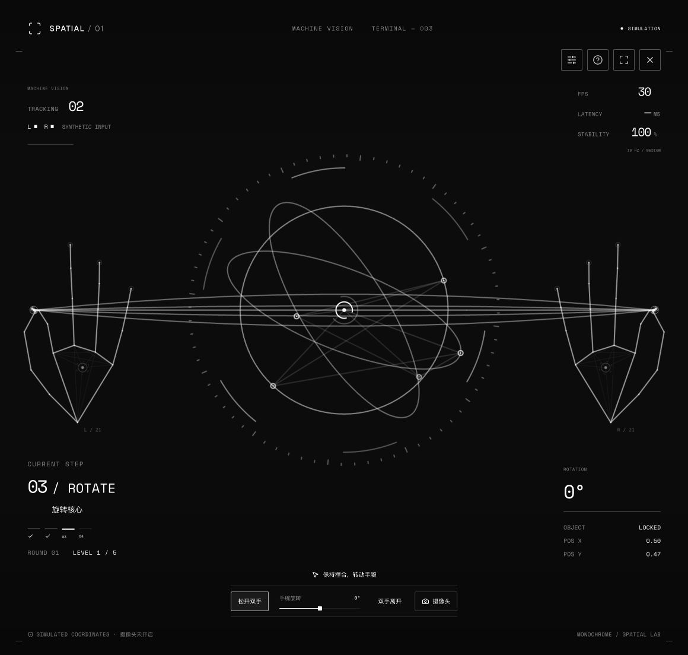
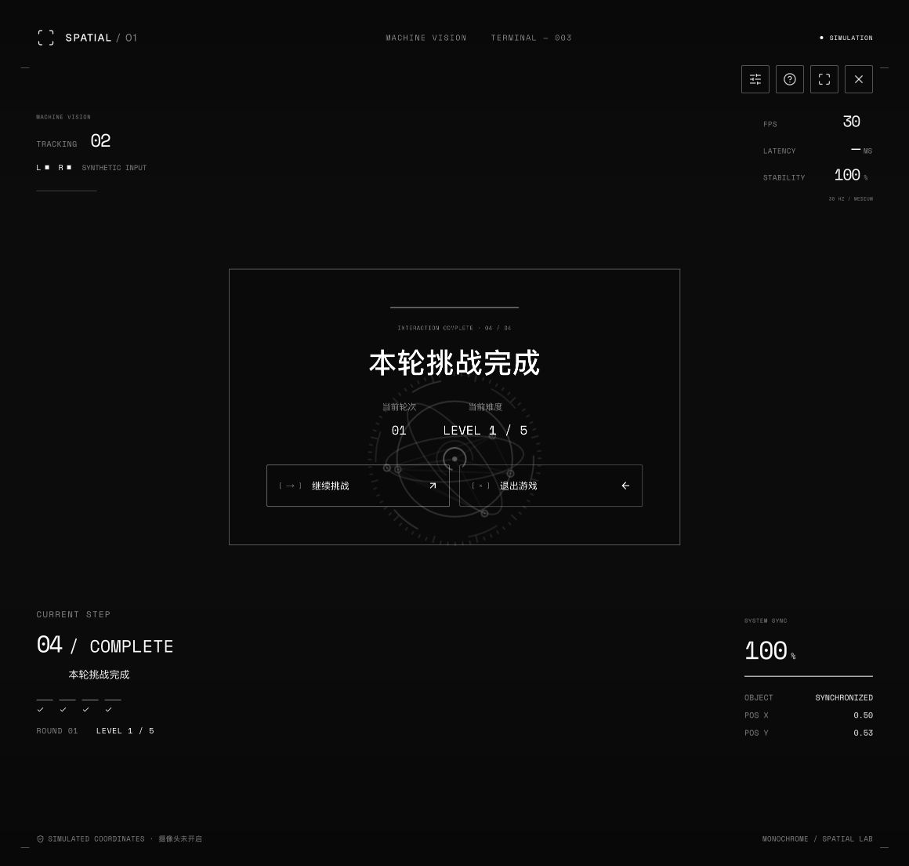

# SPATIAL AR

一款通过摄像头识别手势的 AR 互动小游戏。无需手柄，用双手完成**抓取、拉伸、旋转和压缩**，操控屏幕中的能量核心。

极简黑白视觉，支持多轮渐进挑战，也提供无需摄像头的模拟模式。摄像头画面仅在本机处理，不会上传。基于 MediaPipe 和 Canvas 构建。

[English introduction ↓](#english) · [完整中英文介绍](docs/INTRODUCTION.md)

## 界面预览与玩法

以下为当前页面实截；游戏过程使用内置**模拟模式**，显示合成手部骨骼，不包含真人摄像头画面。

### 首页

开启摄像头体验，或选择无需摄像头的模拟模式。

### 第一步：抓取核心

靠近核心并捏合，保持约 2.5 秒完成抓取。

### 第二、三步：拉伸与旋转

双手拉开使核心展开，再转动双手或手腕至少 3 秒。图中展示展开后进入旋转阶段的核心。

### 第四步：压缩并完成挑战

双掌靠近，压缩核心并自动释放能量。完成后可继续挑战或退出。

---

## English

A webcam-powered AR mini-game that turns your hands into the controller. Capture, stretch, rotate, and compress an energy core with hand gestures. Built with MediaPipe and Canvas.

Minimalist monochrome visuals, progressive challenge rounds, and a camera-free simulation mode. All camera processing happens locally on your device—no video is uploaded.

### How to play

1. **Start:** Open the webcam experience or try the camera-free simulation.
2. **Capture:** Bring your hand near the core and pinch. Keep holding for about 2.5 seconds.
3. **Stretch & rotate:** Move your hands apart to expand the core, then rotate your hands or wrists for at least 3 seconds.
4. **Compress & complete:** Bring your palms closer to compress and release the core. Continue to the next round or exit.

The screenshots above are captured from the current app. Gameplay screenshots use the built-in **simulation mode**, with synthetic hand landmarks and no camera feed.

[Read the bilingual introduction](docs/INTRODUCTION.md)
